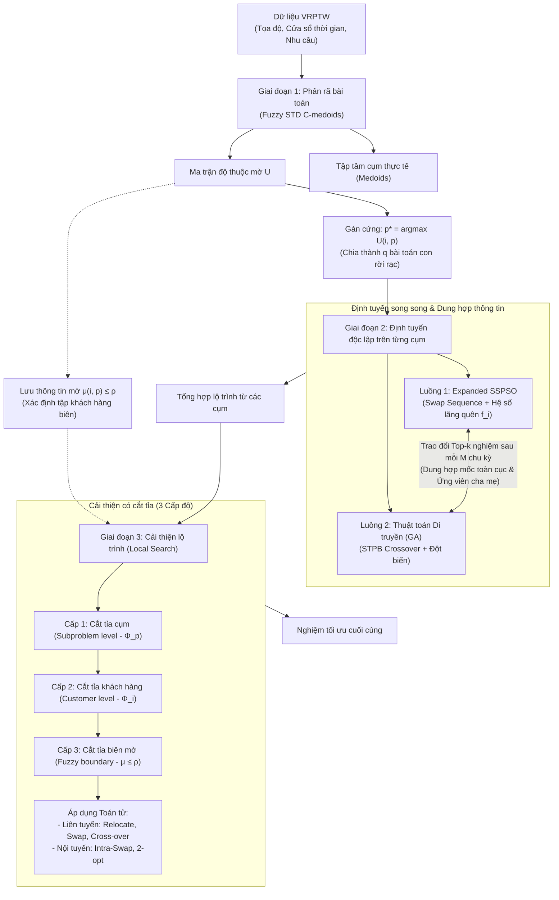
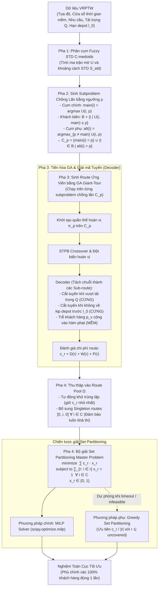

# 1. Mô hình bài toán

- $n$: tổng số khách hàng.
- $K$: Tổng số xe vận chuyển.
- $V = \{1, 2, 3, \dots, K\}$: Tập các xe vận chuyển.
- $C = \{1, 2, 3, \dots, n\}$: Tập khách cần phục vụ.
- $N = \{0, 1, 2, 3, \dots, n\}$: Tập các đỉnh của đồ thị, trong đó 0 là depot.
- $Q_k$: Sức chứa của xe $k$.
- $c_{ij}$: Chi phí để đi từ khách hàng $i$ đến $j$.
- $t_{ij}$: Thời gian di chuyển từ khách hàng $i$ đến $j$.
- $q_i$: Nhu cầu của khách hàng $i$ (quy ước $q_0 = 0$).
- $x_{ij}^k$: 1 nếu xe $k$ đi trực tiếp từ đỉnh $i$ đến đỉnh $j$, ngược lại bằng 0, với $i, j \in N, i \neq j, k \in V$.
- $e_j$: Thời gian sớm nhất có thể phục vụ tại khách hàng $j$.
- $l_j$: Thời gian muộn nhất có thể phục vụ tại khách hàng $j$.
- $s_i$: Thời gian phục vụ khách hàng $i$.
- $w_j^k$: Thời gian xe $k$ phải chờ tại khách hàng $j$ do đến sớm hơn $e_j$.
- $p_j^k$: Thời gian xe $k$ phục vụ trễ hơn so với $l_j$ tại khách hàng $j$.
- $u_j^k$: Thời điểm xe $k$ bắt đầu phục vụ khách hàng $j$.

Biến nhị phân $x_{ij}^k$ biểu diễn xem xe $k$ có đi từ đỉnh $i$ đến đỉnh $j$ hay không trong đó $i \in N, j \in N, k \in V$.

$$x_{ij}^k = \begin{cases} 1 & \text{nếu xe } k \text{ đi từ } i \text{ đến } j \\ 0 & \text{các trường hợp còn lại} \end{cases}$$

Với xe $k$, nếu $x_{ij}^k = 1$ thì thời điểm đến, thời gian chờ, thời điểm bắt đầu phục vụ và thời gian phạt tại $j$ được xác định bởi:

$$a_j^k = \begin{cases} u_i^k + s_i + t_{ij} & \text{Nếu } i \neq 0 \\ t_{0j} & \text{Nếu } i = 0 \end{cases}, \quad w_j^k = \max\{e_j - a_j^k, 0\}$$

$$u_j^k = a_j^k + w_j^k, \quad p_j^k = \max\{a_j^k - l_j, 0\}$$

**Hàm mục tiêu của bài toán:**

$$\min \left( \sum_{i = 0}^{n} \sum_{j = 0, j \neq i}^{n} \sum_{k = 1}^{K} c_{ij} x_{ij}^k + \sum_{i = 1}^{n} \sum_{k = 1}^{K} w_i^k + \sum_{i = 1}^{n} \sum_{k = 1}^{K} p_i^k \right)$$

**Các ràng buộc của bài toán:**

$$\sum_{i = 0, i \neq j}^{n} \sum_{k = 1}^{K} x_{ij}^k = 1 \quad \forall j = 1, \dots, n \quad (3.1)$$

$$\sum_{i = 0, i \neq j}^{n} x_{ij}^k - \sum_{i = 0, i \neq j}^{n} x_{ji}^k = 0 \quad \forall j = 1, \dots, n; \ k = 1, \dots, K \quad (3.2)$$

$$\sum_{i = 0}^{n} q_i \sum_{j = 0, j \neq i}^{n} x_{ij}^k \le Q_k \quad \forall k = 1, \dots, K \quad (3.3)$$

$$\sum_{j = 1}^{n} x_{0j}^k \le 1 \quad \forall k = 1, \dots, K \quad (3.4)$$

$$\sum_{i = 1}^{n} x_{i0}^k \le 1 \quad \forall k = 1, \dots, K \quad (3.5)$$

$$\sum_{i = 0}^{n} x_{i0}^k = \sum_{j = 0}^{n} x_{0j}^k \quad \forall k = 1, \dots, K \quad (3.6)$$

---

# 2. Mô hình thuật toán sử dụng

---

## 2.1. Mô hình 1: Khung thuật toán Phân rã Tiến hóa Kết hợp (Decompose-Route-Improve: Fuzzy c-Medoids + Parallel SSPSO/GA + Local Search)

### Sơ đồ kiến trúc tổng thể Mô hình 1



---

### Chi tiết các giai đoạn của Mô hình 1

### Giai đoạn 1: Phân rã bài toán (Fuzzy c-medoids) [1]

#### Bước 1.1: Trích xuất đặc trưng khách hàng

Mỗi khách hàng $i$ được biểu diễn bằng một vector đặc trưng $\tau_i$:
- **Công thức:** $\tau_i = (x_i, y_i, \theta_i, e_i, l_i, s_i, d_i)$.
- **Cách tính góc $\theta_i$:** Góc tọa độ cực của khách hàng so với trạm (depot) được tính bằng:
  $$\theta_i = \operatorname{arctan2}(y_i - y_0, x_i - x_0)$$
  trong đó $(x_0, y_0)$ là tọa độ depot.

#### Bước 1.2: Tính toán Ma trận Khoảng cách STD

Để biết 2 khách hàng $i$ và $j$ có nên được xếp chung cụm hay không, hệ thống tính toán khoảng cách tổng hợp qua 3 công thức:
- **Khoảng cách không gian mở rộng:**
  $$S_{i,j}^s = \sqrt{(x_j - x_i)^2 + (y_j - y_i)^2 + \lambda \cdot (\theta_j - \theta_i)^2}$$
  ($\lambda$ là trọng số góc, bài báo sử dụng $\lambda = 1$ hoặc $2$).
- **Kiểm tra Ràng buộc Thời gian:**
  - Độ linh hoạt lịch trình: $f_{i,j} = l_j - (e_i + s_i + t_{i,j})$
  - Thời gian chờ tối thiểu: $h_{i,j} = \max\{e_j - (l_i + s_i + t_{i,j}), 0\}$
- **Khoảng cách STD có hướng:**
  $$S_{i,j}^{std} = S_{i,j}^s \cdot \left(2 - \frac{f_{i,j} - h_{i,j}}{l_0 - e_0} + \frac{q_i + q_j}{Q}\right)$$
- **Ma trận đối xứng để phân cụm:**
  $$S_{i,j}^{std} = \min\{S_{i,j}^{std}, S_{j,i}^{std}\}$$

#### Bước 1.3: Chạy thuật toán Fuzzy C-medoids

1. **Input:**
   - Tập khách hàng với các vector đặc trưng 7 chiều $\tau_i = (x_i, y_i, \theta_i, e_i, l_i, s_i, d_i)$.
   - Số lượng cụm cần chia $q$.
   - Tham số kiểm soát độ mờ $m$ (thường đặt bằng 2).
   - Ngưỡng hội tụ $\epsilon$.
   - Ma trận khoảng cách STD đối xứng $S_{i,j}^{std}$.

2. **Khởi tạo:**
   - Khởi tạo ma trận độ thuộc về mờ ban đầu $U^0 = (\mu_{i, V_p})$ với các giá trị ngẫu nhiên trong khoảng $(0; 1)$ đảm bảo tổng mức độ thuộc về tất cả các cụm của mỗi khách hàng phải bằng 1, tức là:
     $$\sum_{p=1}^q \mu_{i, V_p} = 1$$

3. **Vòng lặp chính:**
   Dựa trên ma trận $S_{i,j}^{std}$, thuật toán lặp lại các bước sau cho đến khi ma trận ổn định:
   - **Bước 3.1: Tính toán đặc trưng của cụm ảo ($\tau_p$):** Với mỗi cụm, vector đặc trưng ảo (cũng là một vector ảo 7 chiều) được tính toán bằng cách lấy trung bình có trọng số mờ từ các đặc trưng của tất cả khách hàng thực tế:
     $$\tau_p = \sum_{i=1}^n \mu_{i, V_p} \cdot \tau_i$$
   - **Bước 3.2: Xác định tâm cụm thực tế (Select Medoid):** Do cụm ảo không tồn tại trên thực tế, thuật toán tiến hành chiếu cụm ảo này về một khách hàng thực sự $m_p \in V_c$ làm tâm cụm (medoid). Tâm cụm thực tế được chọn là khách hàng có khoảng cách STD gần nhất với đặc trưng cụm ảo:
     $$m_p = \operatorname{argmin}_{i \in V_c} (S_{i, p}^{std})$$
   - **Bước 3.3: Cập nhật ma trận độ thuộc về mờ ($\mu_{i, V_p}$):** Dựa trên các tâm cụm thực tế vừa được cập nhật, thuật toán tính toán lại mức độ thuộc về cụm của từng khách hàng thực tế đối với mỗi cụm theo công thức:
     $$\mu_{i, V_p} = \frac{1}{\sum_{g=1}^q \left(\frac{S_{i, m_p}^{std}}{S_{i, m_g}^{std}}\right)^{\frac{2}{m-1}}}$$
   - **Gán cứng để tạo Bài toán con:** Sau khi thuật toán hội tụ, khách hàng $i$ sẽ được chốt gán vào cụm $p$ mà nó có $\mu_{i, V_p}$ cao nhất:
     $$p^* = \operatorname{argmax}_p (\mu_{i, V_p})$$

4. **Kết quả đầu ra và Ứng dụng (Outputs):**
   Khi thuật toán đạt điều kiện hội tụ, ma trận độ thuộc về mờ cuối cùng được trả về và phân bổ cho hai mục tiêu:
   - **Phục vụ Giai đoạn Định tuyến (Routing Phase):** Giao mỗi khách hàng vào một bài toán con duy nhất nơi nó đạt độ thuộc về cao nhất để giải độc lập:
     $$p^* = \operatorname{argmax}_p (\mu_{i, V_p})$$
   - **Phục vụ Giai đoạn Cải thiện (Local Search):** Lưu lại thông tin mờ $\mu_{i, V_p}$ để định vị các khách hàng biên mờ (thỏa mãn $\mu_{i, V_p} \le \rho$) giúp cắt tỉa hiệu quả không gian tìm kiếm của LS liên tuyến.

---

### Giai đoạn 2: Định tuyến (Routing)

Mỗi tiểu bài toán sử dụng hai thuật toán chạy song song:

#### A. Luồng EXPANDED SSPSO (PSO Chuỗi Hoán đổi Mở rộng) [2]

1. **Định nghĩa và Cơ chế Mã hóa hạt:**
   PSO cơ bản được thiết kế cho không gian liên tục nên được chuyển đổi sang dạng rời rạc bằng Chuỗi hoán đổi (Swap Sequence) và áp dụng các chiến lược nâng cao của XPSO:
   - **Mã hóa cá thể (Vị trí $X$):** Mỗi cá thể (hạt) $S$ là một chuỗi số nguyên không lặp lại, đại diện cho danh sách/thứ tự ưu tiên của các khách hàng cần phục vụ. Ví dụ: $S = (1, 3, 5, 2, 4)$.
   - **Toán tử hoán đổi (Swap Operator):** Là thao tác hoán đổi giá trị tại hai vị trí $i$ và $j$ của một chuỗi số cho nhau, ký hiệu $SO(i, j)$.
   - **Vận tốc:** Là một chuỗi bao gồm nhiều phép toán hoán đổi vị trí được xếp theo thứ tự, ví dụ $SS = (SO_1, \dots, SO_n)$.
   - **Toán tử cộng ($\oplus$):** Là hành động áp dụng tuần tự một chuỗi hoán đổi lên cá thể $S$. Ký hiệu $S' = S \oplus SS$ nghĩa là áp dụng các phép hoán đổi của $SS$ lên $S$ để biến nó thành vị trí mới $S'$.
   - **Toán tử trừ ($\ominus$):** Là phép tính tìm ra tập hợp chuỗi hoán đổi $SS$ cần thiết để biến cá thể $B$ thành cá thể $A$. Ký hiệu $SS = A \ominus B$ (tương đương với $B \oplus SS = A$).
   - **Công thức Vận tốc:**
     $$V_t = w V_{t-1} \oplus r_1 (Pbest \ominus X_{t-1}) \oplus r_2 (Gbest \ominus X_{t-1})$$
   - **Công thức Vị trí:**
     $$X_t = X_{t-1} \oplus V_t$$
     Với $w, r_1, r_2$ là các số thực ngẫu nhiên trong khoảng $(0, 1)$. $r_1(Pbest \ominus X_{t-1})$ là phép toán $(Pbest \ominus X_{t-1})$ có thể được giữ lại với xác suất $r_1$, tương tự cho $r_2(Gbest \ominus X_{t-1})$ và $w V_{t-1}$.

2. **Chiến lược Tiến hóa Nâng cao của SSPSO:**
   Sau khi đã thiết lập được không gian toán học rời rạc bằng các công thức trên, luồng SSPSO tối ưu hóa quá trình bay của bầy đàn bằng các chiến lược:
   - **Đưa vào Khả năng lãng quên ($f_i$):** Để tránh bầy đàn bị kẹt ở cực tiểu cục bộ (hội tụ quá sớm), mỗi hạt $i$ được gán một hệ số lãng quên $f_i$ dựa trên khoảng cách của nó tới hạt tốt nhất toàn cục ($Gbest$). Hạt càng xa $Gbest$ thì khả năng lãng quên càng lớn, giúp nó bỏ qua một số kinh nghiệm cũ để mạnh dạn khám phá các vùng không gian mới.
   - **Hệ số gia tốc thích nghi ($c_p, c_l, c_g$):** Thay vì dùng hằng số, các hệ số học hỏi từ Kỷ lục cá nhân ($Pbest$), Kỷ lục khu vực láng giềng ($Lbest$) và Kỷ lục toàn bầy ($Gbest$) được lấy mẫu liên tục qua hàm phân phối Gaussian $\mathcal{N}(\mu, \sigma^2)$ dựa trên kinh nghiệm của các hạt tinh hoa.
   - **Cập nhật Vận tốc và Vị trí vòng lặp $t$:**
     $$V_t = V_{t-1} \oplus c_p r_1 (Pbest \ominus X_{t-1}) \oplus c_l r_2 (Lbest \ominus X_{t-1}) \oplus c_g r_3 (Gbest \ominus X_{t-1})$$
     $$X_t = X_{t-1} \oplus V_t$$
     *(Ý nghĩa: Vận tốc mới được tổng hợp từ vận tốc cũ, cộng thêm các bước hoán đổi để hướng về $Pbest, Lbest$ và $Gbest$. Hệ số $(1 - f_i)$ cho thấy hạt sẽ "quên" đi một phần các bước hoán đổi hướng về $Lbest$ và $Gbest$ để duy trì sự đa dạng).*

#### B. Luồng GA (Thuật toán Di truyền)
Thực hiện tương tự như bài báo với mô hình MKGA của hội thảo ICISN đợt trước.

#### 3.3. Cơ chế Trao đổi giữa các Thuật toán (Communication & Fusion) [3]
Điểm cốt lõi của mô hình là sự hợp tác định kỳ giữa luồng GA và PSO để tận dụng ưu thế của nhau (PSO mạnh về hội tụ, GA mạnh về lai tạo chéo).
- **Điều kiện kích hoạt:** Quá trình trao đổi diễn ra định kỳ sau mỗi chu kỳ $M$ vòng lặp tiến hóa độc lập.
- **Xuất thông tin (Communication Out):** Mỗi thuật toán sẽ trích xuất ra $k$ giải pháp/lộ trình (Top-$k$ Best Solutions) có chất lượng cao nhất của mình ở thời điểm hiện tại để gửi cho đối phương.
- **Dung hợp thông tin (Fusion Strategies):**
  - **Tại luồng GA:** Các lộ trình ngoại lai nhận được từ PSO sẽ được đưa trực tiếp vào tập ứng viên "cha mẹ" (candidate parents). GA sau đó sử dụng phương pháp chọn lọc tỷ lệ thích nghi trên tập này để lựa chọn ra các cá thể tham gia lai ghép, giúp mã di truyền tốt của PSO được truyền lại cho thế hệ con của GA.
  - **Tại luồng Enhanced SSPSO:** Các lộ trình ngoại lai nhận được từ GA được xem như các mốc toàn cục bổ sung (ký hiệu là $P_{o1}, P_{o2}, \dots, P_{on}$). Phương trình vận tốc cốt lõi của PSO được mở rộng để các hạt điều hướng một phần vận tốc về phía các cấu trúc ngoại lai này:
    $$V_t = w V_{t-1} \oplus r_1 (Pbest \ominus X_{t-1}) \oplus r_2 (Gbest \ominus X_{t-1}) \oplus r_3 (P_{o1} \ominus X_{t-1}) \dots \oplus r_{n+2} (P_{on} \ominus X_{t-1})$$
    $$X_t = X_{t-1} \oplus V_t$$
    Với $r_1, \dots, r_{n+2}$ là số thực ngẫu nhiên khoảng từ $(0, 1)$.

---

### Giai đoạn 3: Cải thiện lộ trình (Local Search)

#### Bước 1: Đánh giá chất lượng và Sắp xếp thứ tự ưu tiên duyệt
Thay vì duyệt ngẫu nhiên, thuật toán tính toán các chỉ số hiệu quả để ưu tiên xử lý các vùng "tệ nhất" trước nhằm tối đa hóa cơ hội cải thiện lời giải:
1. **Tổng chi phí di chuyển của cụm $P_p$ ($Z_{R_p}$):**
   $$Z_{R_p} = \sum_{R \in R_p} \sum_{e_{i,j} \in R} c_{i,j}$$
2. **Chi phí trung bình trên mỗi tuyến của cụm $P_p$ ($\bar{Z}_{R_p}$):**
   $$\bar{Z}_{R_p} = \frac{1}{|R_p|} Z_{R_p}$$
3. **Hiệu suất lấp đầy tải trọng xe ($u_R$) trên tuyến $R \in R_p$:**
   $$u_R = \frac{\sum_{i \in R} d_i}{Q}$$

**Trình tự ưu tiên duyệt Tìm kiếm cục bộ (LS) được thiết lập:**
- Thuật toán bắt đầu chạy LS từ các tuyến xe thuộc cụm có chi phí trung bình mỗi tuyến tệ nhất: $\operatorname{argmax}_p (\bar{Z}_{R_p})$.
- Trong cùng một cụm tệ đó, các tuyến xe $R$ được sắp xếp tăng dần theo hiệu suất sử dụng tải trọng $u_R$ (ưu tiên cải thiện xe rỗng tải trước).
- Tuyến xe cuối cùng mà thuật toán chạm tới là tuyến đầy tải nhất của cụm tối ưu nhất: $R = \operatorname{argmax}_R (u_R)$ thuộc cụm $\operatorname{argmin}_p (\bar{Z}_{R_p})$.

#### Bước 2: Cơ chế cắt tỉa (Pruning) dựa trên dữ liệu Không - Thời - Cầu
Để tránh bùng nổ tổ hợp tính toán trên các bài toán quy mô hàng nghìn khách hàng, thuật toán áp dụng cơ chế cắt tỉa 3 cấp độ để chỉ tập trung vào các hoán đổi "đáng giá" ở vùng ranh giới:
- **Cắt tỉa cấp độ cụm (Subproblem level):** Một phép hoán đổi liên tuyến chỉ được thử giữa hai tuyến xe $(R, R')$ thuộc hai cụm khác nhau $P_p$ và $P_g$ ($p \neq g$) nếu cụm $P_g$ nằm trong vùng lân cận $\Phi_p$ (gồm $\phi$ cụm tương đồng nhất với $P_p$ dựa trên khoảng cách STD giữa các cụm). Trong thực nghiệm, tác giả khuyến nghị đặt $\phi = 5$.
- **Cắt tỉa cấp độ khách hàng (Customer level):** Một nước đi LS tác động lên khách hàng $i$ chỉ được phép ghép cặp/hoán đổi với khách hàng $j$ trên tuyến khác nếu $j$ nằm trong tập lân cận đỉnh $\Phi_i$ (gồm $\varphi$ khách hàng tương đồng nhất với $i$ dựa trên khoảng cách STD từng cặp). Tác giả khuyến nghị đặt $\varphi = 10$.
- **Cắt tỉa cấp độ biên mờ (Fuzzy boundary level):** Nếu sử dụng thuật toán phân cụm mờ Fuzzy c-medoids ở Giai đoạn 1, mỗi khách hàng $i \in R$ (thuộc cụm $P_p$) chỉ được phép tham gia vào LS liên tuyến nếu mức độ thuộc về cụm của nó đủ thấp: $\mu_{i, V_p} \le \rho$ (nằm ở ranh giới mờ giữa các cụm). Tác giả khuyến nghị giữ $\rho \le 0.50$ để tiết kiệm thời gian chạy mà vẫn đảm bảo hiệu quả cải thiện.

#### Bước 3: Áp dụng các toán tử Local Search
Khi các cặp tuyến và khách hàng vượt qua bộ lọc cắt tỉa ở Bước 2, thuật toán tiến hành cải tiến lộ trình thông qua sự kết hợp của hai nhóm toán tử:
- **Các toán tử liên tuyến (Inter-route operators) - Tối ưu hóa việc gán khách hàng:**
  - **Relocate:** Gỡ bỏ khách hàng $i$ khỏi tuyến hiện tại và chèn vào vị trí bên cạnh khách hàng $j$ trên tuyến của cụm lân cận.
  - **Swap:** Tráo đổi vị trí của hai khách hàng mờ thuộc hai tuyến của hai cụm khác nhau.
  - **Cross-over:** Cắt đôi hai tuyến xe tại vị trí xác định và hoán đổi phần đuôi của chúng cho nhau.
- **Các toán tử nội tuyến (Intra-route operators) - Tối ưu hóa trình tự đi của xe:**
  - Ngay sau khi một toán tử liên tuyến thực hiện thành công và làm thay đổi cấu trúc phân bổ khách hàng của một tuyến, thuật toán lập tức áp dụng các toán tử nội tuyến như Swap và 2-opt trên tuyến mới cập nhật ($R^*$).
  - Bước này sắp xếp lại trình tự viếng thăm nội bộ của riêng chiếc xe đó sao cho tối ưu nhất.

---

## 2.2. Mô hình 2: Mô hình FSRD-SP (Fuzzy STD Rho-overlapping Decomposition with Route-pool Set Partitioning)

### Sơ đồ kiến trúc tổng thể Mô hình 2



---

### Chi tiết các pha của Mô hình 2 (FSRD-SP)

### Pha 1: Fuzzy STD C-medoids
Mỗi khách hàng được biểu diễn bởi vector 7 chiều $\tau_i = (x_i, y_i, \theta_i, e_i, l_i, s_i, q_i)$ với $\theta_i = \operatorname{arctan2}(y_i - y_0, x_i - x_0)$.
Khoảng cách không gian - thời gian - nhu cầu đối xứng $S_{i,j}^{std}$ được tính toán tương tự Giai đoạn 1 của Mô hình 1:
- Khoảng cách không gian mở rộng: $S_{i,j}^s = \sqrt{(x_j - x_i)^2 + (y_j - y_i)^2 + \lambda (\theta_j - \theta_i)^2}$.
- Độ linh hoạt $f_{i,j} = l_j - (e_i + s_i + t_{i,j})$ và thời gian chờ tối thiểu $h_{i,j} = \max\{e_j - (l_i + s_i + t_{i,j}), 0\}$.
- Khoảng cách STD có hướng: $\tilde{S}_{i,j}^{std} = S_{i,j}^s \left(2 - \frac{f_{i,j} - h_{i,j}}{l_0 - e_0} + \frac{q_i + q_j}{Q}\right)$.
- Khoảng cách đối xứng: $S_{i,j}^{std} = \min\{\tilde{S}_{i,j}^{std}, \tilde{S}_{j,i}^{std}\}$.

Thuật toán sinh ra ma trận độ thuộc về mờ $U = (\mu_{i, p}) \in [0, 1]^{n \times q}$ thỏa mãn $\sum_{p=1}^q U[i, p] = 1, \forall i \in C$.

---

### Pha 2: Tạo Subproblem Chồng Lấn bằng Ngưỡng $\rho$ (Rho-overlapping Subproblems)
Khác với việc gán cứng phân hoạch rời rạc làm mất cơ hội tìm kiếm liên ranh giới, mô hình FSRD-SP sử dụng ngưỡng cố định $\rho \in [0, 1]$ để tạo các bài toán con có phần chồng lấn:
1. **Xác định cụm chính:** $\operatorname{main}(i) = \operatorname{argmax}_p U[i, p]$.
2. **Xác định tập khách hàng biên:**
   $$B = \{ i \in C \mid U[i, \operatorname{main}(i)] \le \rho \}$$
3. **Xác định cụm phụ cho khách hàng biên:**
   $$\operatorname{alt}(i) = \operatorname{argmax}_{p \ne \operatorname{main}(i)} U[i, p] \quad \forall i \in B$$
4. **Tạo subproblem $C_p$:**
   $$C_p = \{i \in C \mid \operatorname{main}(i) = p\} \cup \{i \in B \mid \operatorname{alt}(i) = p\}$$

*Đặc điểm:* Mỗi khách hàng thuộc tối đa 2 subproblem (cụm chính và 1 cụm phụ), giúp mở rộng không gian tìm kiếm lộ trình cho các khu vực ranh giới mà không làm bùng nổ kích thước bài toán.

---

### Pha 3: Sinh Route Ứng Viên bằng GA Giant-Tour & Decoder

Trên mỗi subproblem $C_p$, thuật toán Di truyền (GA) tiến hóa trên không gian hoán vị khách hàng $\pi_p = (v_1, v_2, \dots, v_m)$.

#### Cơ chế Giải mã Tuyến (Decoder Rule):
Một cá thể giant-tour được giải mã tuần tự thành các sub-route hợp lệ:
```text
route = [0]
current_load = 0
current_time = e_0

FOR mỗi khách hàng v trong hoán vị π_p:
    tính thời điểm đến a_v, thời gian chờ w_v, thời điểm bắt đầu phục vụ u_v
    
    // Kiểm tra ràng buộc cứng:
    IF current_load + q_v > Q  HOẶC  u_v + s_v + t_v0 > l_0:
        đóng route hiện tại bằng cách quay về depot (0)
        mở route mới xuất phát từ depot (0)
        tính lại a_v, w_v, u_v từ depot
        
    thêm v vào route hiện tại
    cập nhật current_load = current_load + q_v
    cập nhật current_time = u_v + s_v

đóng route cuối cùng bằng depot (0)
```

#### Đánh giá chi phí route $c_r$:
Với mỗi sub-route $r = (0, v_1, v_2, \dots, v_k, 0)$:
- Tổng quãng đường di chuyển: $D(r) = \sum_{(i, j) \in r} c_{ij}$
- Tổng thời gian chờ: $W(r) = \sum_{i \in r} w_i$
- Tổng thời gian trễ cửa sổ thời gian mềm: $P(r) = \sum_{i \in r} p_i$, trong đó $p_i = \max\{u_i - l_i, 0\}$
- **Chi phí tổng hợp của route $c_r$:**
  $$c_r = D(r) + W(r) + P(r)$$

---

### Pha 4: Route Pool $\Omega$ & Bài Toán Set Partitioning Master Problem

1. **Quản lý Route Pool $\Omega$:**
   - Tất cả các sub-route sinh ra từ các thế hệ GA trên mọi subproblem được đưa vào Route Pool $\Omega$.
   - Tự động khử trùng lặp: Nếu hai route có cùng danh sách khách hàng, chỉ giữ lại bản có chi phí $c_r$ nhỏ nhất.
   - **Singleton Routes:** Bổ sung các route đơn lẻ $[0, i, 0]$ cho mọi $i \in C$. Điều này bảo đảm bài toán Set Partitioning luôn tồn tại nghiệm khả thi bao phủ $100\%$ khách hàng.

2. **Mô hình Quy hoạch Nguyên Set Partitioning:**
   Đặt biến nhị phân $x_r \in \{0, 1\}$ ($x_r = 1$ nếu route $r \in \Omega$ được chọn trong nghiệm cuối cùng):

   $$\min \sum_{r \in \Omega} c_r \cdot x_r$$

   $$\text{thỏa mãn:} \quad \sum_{r \in \Omega, i \in r} x_r = 1 \quad \forall i \in C$$

   $$\sum_{r \in \Omega} x_r \le K \quad (\text{tùy chọn giới hạn số xe})$$

   $$x_r \in \{0, 1\} \quad \forall r \in \Omega$$

3. **Thuật toán giải Set Partitioning:**
   - **MILP Solver:** Sử dụng `scipy.optimize.milp` để tìm chính xác tổ hợp route tối ưu toàn cục.
   - **Greedy Fallback:** Nếu bài toán quá lớn hoặc solver không khả thi, lần lượt chọn route có tỷ lệ $\frac{c_r}{|r|}$ nhỏ nhất phủ các khách hàng chưa được phục vụ ($r \subseteq \text{uncovered}$).

---

# Tài liệu tham khảo

1. Kerscher, C., & Minner, S. (2024). Spatial-temporal-demand clustering for solving large-scale vehicle routing problems with time windows. *ArXiv*, abs/2402.00041.
2. B. A. S. Emambocus, M. B. Jasser, M. Hamzah, A. Mustapha and A. Amphawan, "An Enhanced Swap Sequence-Based Particle Swarm Optimization Algorithm to Solve TSP," in *IEEE Access*, vol. 9, pp. 164820-164836, 2021, doi: 10.1109/ACCESS.2021.3133493.
3. Bai, Z., Snášel, V., Mirjalili, S. et al. A novel membrane-inspired evolutionary algorithm framework for VRPTW. *Appl Intell* 56, 57 (2026). https://doi.org/10.1007/s10489-025-07068-y
